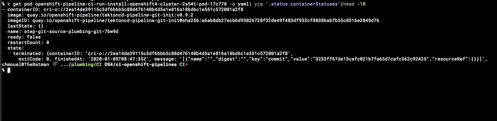

# Misc scripts

## [gg](gg) - Grep with RG and FZF and edit it there

## [yjq](gg) - query yaml with jq

## route53-delete-record

How to delete route53 records with boto, cause it's an insane amount of `b****ck` with the aws cli
